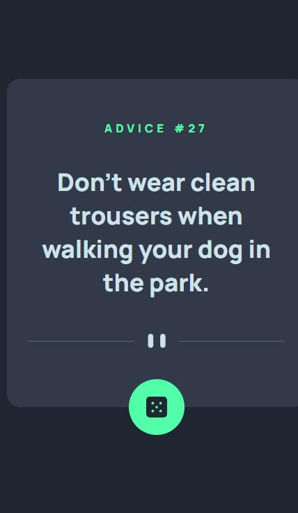
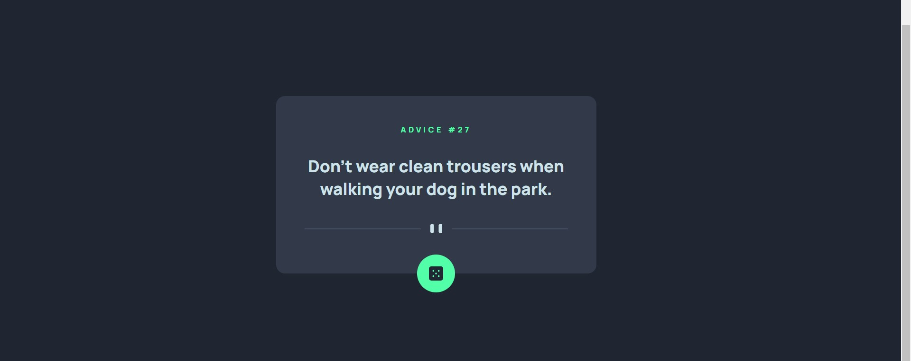

# Frontend Mentor - Advice generator app solution

This is a solution to the [Advice generator app challenge on Frontend Mentor](https://www.frontendmentor.io/challenges/advice-generator-app-QdUG-13db). Frontend Mentor challenges help you improve your coding skills by building realistic projects.

## Table of contents

- [Overview](#overview)
  - [The challenge](#the-challenge)
  - [Screenshot](#screenshot)
  - [Links](#links)
- [My process](#my-process)
  - [Built with](#built-with)
  - [What I learned](#what-i-learned)
  - [Continued development](#continued-development)
  - [Useful resources](#useful-resources)
- [Author](#author)
- [Acknowledgments](#acknowledgments)

**Note: Delete this note and update the table of contents based on what sections you keep.**

## Overview

### The challenge

Users should be able to:

- View the optimal layout for the app depending on their device's screen size
- See hover states for all interactive elements on the page
- Generate a new piece of advice by clicking the dice icon

### Screenshot

### mobile version

### desktop version

### Links

- Github repository: [advice generator app repository](https://github.com/yochainoah/advice-generator-app)
- githubpages: [Advice generator app](https://yochainoah.github.io/advice-generator-app/)

## My process

### Built with

- Semantic HTML5 markup
- CSS custom properties
- Flexbox
- Mobile-first workflow
- JS

### Continued development

I will continue develping new projects on frontend mentor

**Note: Delete this note and the content within this section and replace with your own plans for continued development.**

### Useful resources

- [W3schools](https://www.w3schools.com/) 
- [Frontend mentor](https://www.frontendmentor.io/home)

## Author

- Github - [yochai heinrich](https://github.com/yochainoah)
- Frontend Mentor - [@yochainoah](https://www.frontendmentor.io/profile/yochainoah)
